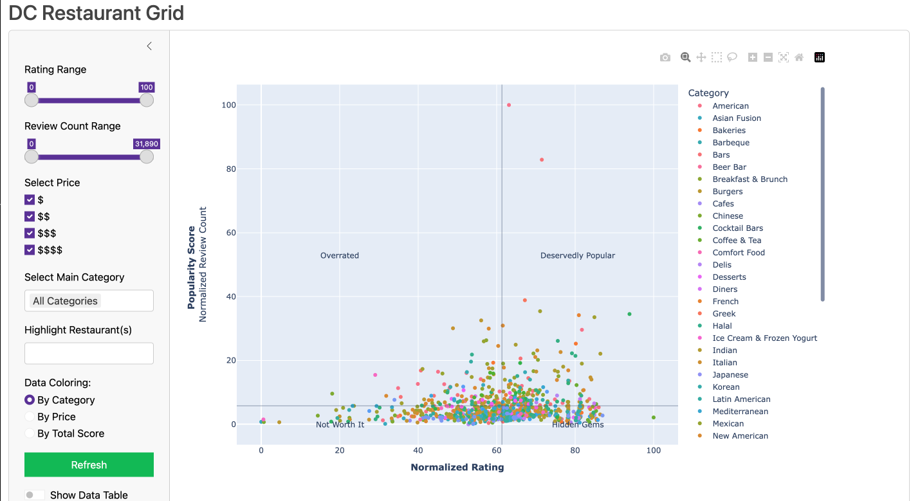
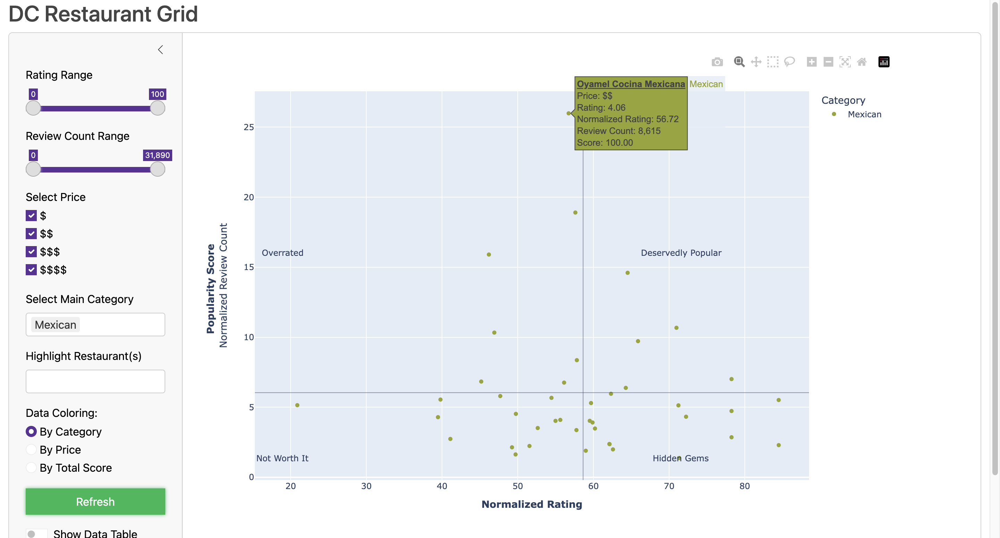
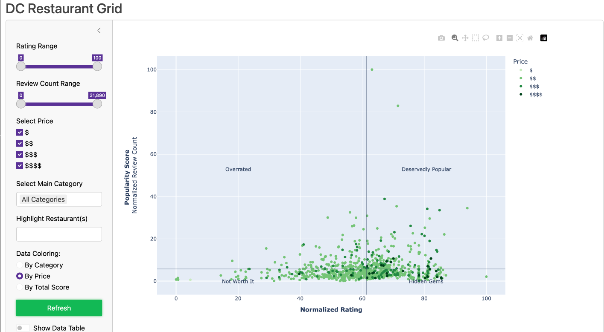
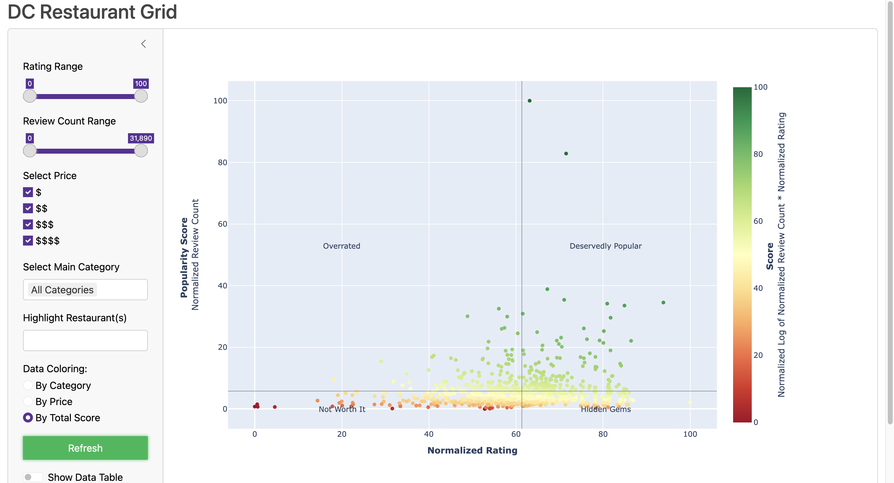
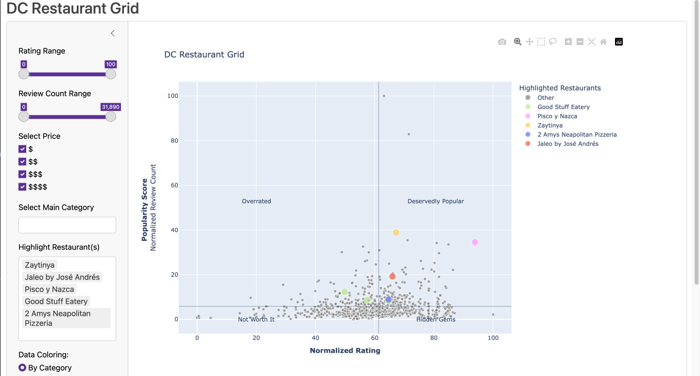
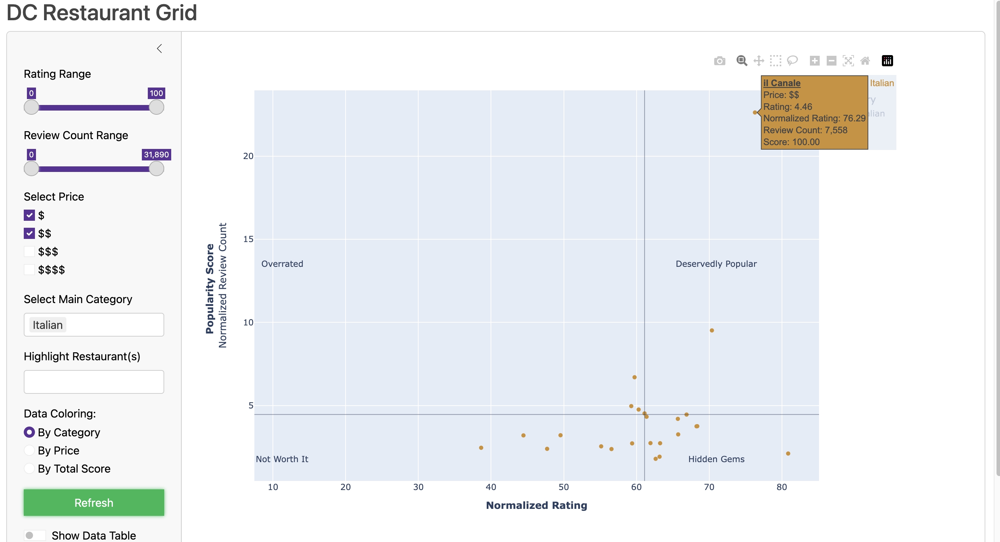
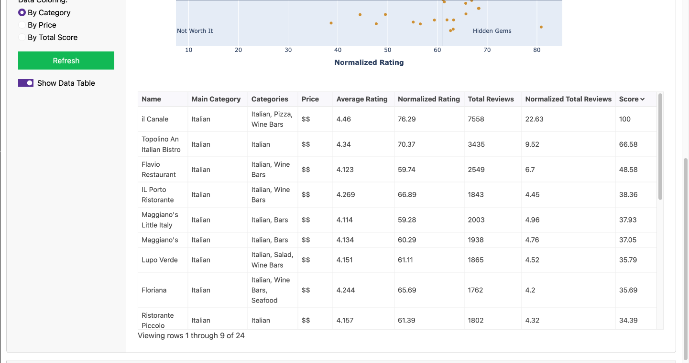

# [Restaurant Grid](https://austinbarish.shinyapps.io/restaurantgrid/)



## Description

[Restaurant Grid](https://austinbarish.shinyapps.io/restaurantgrid/) is a web application that better displays food options in DC by plotting them on a normalized grid between ratings and review counts to understand the best places to eat in DC, better than the often difficult to parse Yelp and Google reviews that rarely extend beyond 3.5 to 5 stars. Here, you can better view how restaurant ratings are distributed and make a more informed decision on where to eat. Furthermore, you can see what restaurants are the most popular and whether or not they are worth the hype. Perhaps you will find a hidden gem that you never knew existed! If you find a restaurant you are interested in, you can select its title on its tooltip to be taken to its Yelp page.

## Data Collection

The data was collected using the [Yelp API](https://www.yelp.com/developers) to collect all of the restaurants in DC. Any business not found on Yelp is not included in the dataset. Using those locations, I then used the [Google Places API](https://developers.google.com/places/web-service/intro) to collect the ratings and review counts for each restaurant by searching for "{restaurant name} DC" and selecting the first results. These are then combined into a single dataset with an inner join on the restaurant name. The reviews are then totalled and an average rating is calculated using:

$\text{Average Rating} = \frac{(\text{Google Rating} * \text{Google Review Count}) + (\text{Yelp Rating} * \text{Yelp Review Count})}{\text{Google Review Count} + \text{Yelp Review Count}}$

These are then normalized and scaled to be between 0 and 100. Finally, the top 48 main categories, as listed on google, are kept. If a restaurants main category is not in the Top 48, its other category listing are checked and, if any of them are in the top 48, they are kept. Otherwise, the restaurant is listed under "Other". 

All of the data is stored on [Github](./data/dc_reviews_cleaned.csv).

## Scoring

I have included a metric title "Score" that seeks to combine popularity and rating into one number. The formula is as follows:

$\text{df["score"]} = \left(\text{df["normalized\_rating"]} \times 10\right) \times \left(\frac{\text{df["normalized\_total\_reviews"]}}{100}\right)$

$\text{df["score"]} = \begin{cases} 
0 & \text{if } \text{df["score"]} = 0 \\
\ln(\text{df["score"]} + 1) & \text{otherwise}
\end{cases}$

$\text{df["score"]} = \text{scaler.fit\_transform(df["score"])} \times 100$

$\text{df["score"]} = \text{df["score"].round(2)}$

This gives a range of scores between 0 and 100, with 100 being the best score. This score is intended to be a recommendation of places to go. For example, if you are new to the area and want to check out the "best" spots, you are likely looking for a combination of the most population places that are deserving of their popularity. This score is intended to capture that.

## Usage

The web application is hosted on [shinyapps.io](https://austinbarish.shinyapps.io/restaurantgrid/). It is also available to run locally by cloning this repository and running the following command inside the repository:

```bash
shiny run --reload
```

## Features

The Restaurant Grid has a number of filtering and selection options to find a restaurant you are looking for. With many of the filtering procedures, the data will automatically update to reflect your selection, ensuring that you are always getting an apples-to-apples comparison.

### Best By Category



First, you can filter by category to only compare restaurants in one or a few categories. For example, you could select "Mexican" to look at all the Mexican restaurants in DC. You can also select multiple categories to compare them. For example, you could select "Mexican" and "Italian" to compare the best Mexican and Italian restaurants in DC.

### Best Prices



You can change the coloring to reflect the price of the restaurant. This is based on the price category of the restaurant as listed on Google. This is a good way to find the best restaurants in your price range and find the best bang for your buck. You are also capable of filtering by price while keeping the coloring as by category or score. 

### Best Scores



You can also color by score to best see the top spots to visit in DC, as chosen by user preferences. This allows you to better see whether one spots lack of popularity might make up for it in its rating or vice versa. 

### Highlight Restaurants



You can search any restaurant(s) to highlight it on the chart, easily illuminate them on the chart. If you search a restaurant that is not found in the current filters, all of the points will appear gray. If you search a restaurant that is found in the current filters, all of the points will appear gray except for the searched restaurant(s), which will appear in their respective colors as indicated by the legend. *This will supersede any coloring by category, price, or score.*

### Combine Filters



You can combine any of the above filters to find the best restaurants in DC for your preferences. For example, if you are looking for cheap Italian food, you can select "Italian" as the category and "\$""\$$" as the price to find the best cheap Italian restaurants in DC.

### View Data



If you would like to view the data in the chart, you can simply click the "Show Data Table" button and the table will appear below the chart. This table reflects the result of the filters, meaning if a restaurant is not within the set filters, it will not appear in the chart. The data can be sorted by any of its columns by simply clicking on the column headers. 
